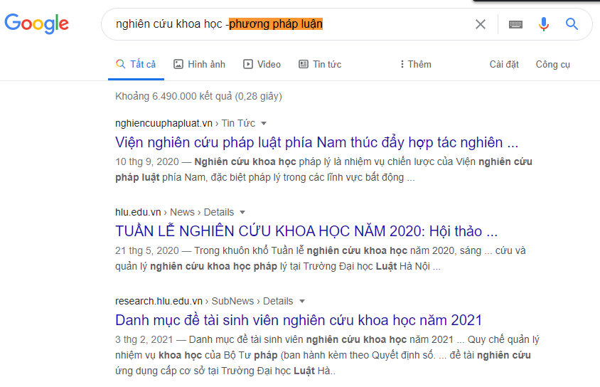

## [Authors](https://github.com/trandinhkhang0279/CS519.L21.KHTN/blob/master/README.md)
Class | ID | Name | Role | Git
--- | --- | --- | --- | ---
CS519.L21.KHTN | 18520896 | Trần Đình Khang | *Leader* | [trandinhkhang0279](https://github.com/trandinhkhang0279)
CS519.L21.KHTN | 18520194 | Trương Đức Vũ | *Member* | [ducvuuit](https://github.com/ducvuuit)

# QT11: TÌM KIẾM GOOGLE NÂNG CAO (Advanced Google Search)

### _**Yêu cầu:** Hãy cho biết các tính năng tìm kiếm nâng cao của Google để tìm kiếm thông tin hiệu quả hơn._

## 1. Tìm kiếm cụm từ chính xác

- Nội dung: Đặt cụm từ muốn tìm kiếm trong dấu trích dẫn giúp bạn tìm được kết quả có chính xác cụm từ mà bạn tìm kiếm.

- Cấu trúc: <"cụm từ tìm kiếm">

- Ví dụ: "nghiên cứu khoa học". Kết quả trả về sẽ có đúng cụm từ **nghiên cứu khoa học** như bên dưới:

## 2. Loại trừ từ
- Nội dung: Giúp loại bỏ kết quả trả về có chứa từ không mong muốn bằng cách đặt dấu trừ ngay trước từ đó.

- Cấu trúc: -<từ không mong muốn> hoặc -<"từ không mong muốn">

- Ví dụ: nghiên cứu khoa học -"phương pháp luận". Kết quả trả về sẽ có liên quan đến cụm từ "nghiên cứu khoa học"
  nhưng không chứa cụm từ "phương pháp luận" như bên dưới:

## 3. Toán tử OR
- Nội dung: Giúp trả về các kết quả có liên quan đến ít nhất một trong các cụm từ bạn tìm kiếm.

- Cấu trúc: <"từ tìm kiếm 1"> OR <"từ tìm kiếm 2"> OR <...> _(lưu ý: từ OR viết in hoa)_

- Ví dụ: "kinh doanh quốc tế" OR "khoa học máy tính". Kết quả trả về sẽ chứa đúng ít nhất 1 trong 2 cụm từ tìm kiếm
như bên dưới:

## 4. Tìm các từ trong văn bản
- Nội dung: Kết quả trả về một trang web có nội dung liên quan đến các từ được tìm kiếm nhưng các từ này không nhất
  thiết phải đứng cạnh nhau.

- Cấu trúc: **allintext:** <các từ, cụm từ tìm kiếm>

- Ví dụ: **allintext:** nghiên cứu khoa học UIT khoa học máy tính

## 5. Tìm các từ trong tiêu đề
- Nội dung: Kết quả trả về một trang web có tiêu đề liên quan đến các từ được tìm kiếm nhưng các từ này không nhất 
  thiết phải đứng cạnh nhau.

- Cấu trúc: **allintitle:** <các từ, cụm từ tìm kiếm>

- Ví dụ: **allintitle:** OEP UIT. Kết quả trả về các trang web có tiêu đề chứa các cụm từ UIT và OEP nhưng các cụm từ 
  này không nhất thiết phải đứng cạnh nhau như hình bên dưới:

## 6. Tìm kiếm cụm từ chính xác trong trang web
- Nội dung: Dùng để tìm kiếm từ khoá cụ thể trong một trang web cụ thể ngay cả khi trang web này không hỗ trợ tính
  năng tìm kiếm.

- Cấu trúc: **site:** <trang web tìm kiếm> <cụm từ tìm kiếm>

- Ví dụ: **site:** daa.uit.edu.vn lịch thi. Kết quả trả về các trang web có trang web gốc là daa.uit.edu.vn và có nội
dung liên quan từ khoá "lịch thi".

## 7. Tìm loại file tài liệu cụ thể
- Nội dung: Kết quả trả về các trang web có loại file tài liệu cụ thể mà bạn mong muốn. 

- Cấu trúc: <cụm từ tìm kiếm> **filetype:** <loại file>

- Ví dụ: nghiên cứu khoa học **filetype:** pdf. Kết quả trả về các trang web có chứa tài liệu **pdf** liên quan đến
  từ khoá "nghiên cứu khoa học".

## 8. Lọc kết quả tìm kiếm theo ngôn ngữ, thời gian
- Nội dung: Bên cạnh cách tính năng trên, để có được kết quả mong muốn,
  bạn có thể dùng công cụ lọc kết quả theo ngôn ngữ và thời gian.

- Ví dụ: Lọc kết quả trả về với các trang bằng tiếng Việt trong thời gian 1 tuần vừa qua như bên dưới:

